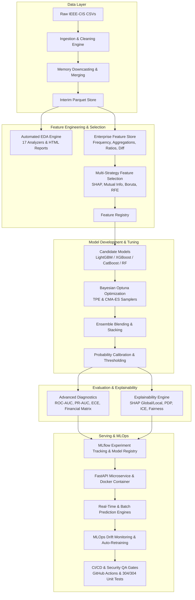

# IEEE-CIS Enterprise Financial Fraud Detection & Optimization System

[]()
[]()
[-success.svg)]()
[]()
[]()
[]()
[]()
[]()
[]()

Production-grade, enterprise-scale **Machine Learning & MLOps System** for **IEEE-CIS Financial Fraud Detection**. Built with modular Python 3.10 architecture, DVC data science pipeline orchestration, multi-model ensemble algorithms (LightGBM, XGBoost, CatBoost), Bayesian hyperparameter tuning with Optuna, SHAP explainability, real-time sub-10ms FastAPI serving, continuous drift monitoring, automated retraining, and CI/CD quality gates.

---

## 🎯 Executive Summary & Business Impact

Financial fraud detection presents extreme class imbalance (~3.5% fraud rate) across high-volume transaction data. This system maximizes **Net Financial Savings** by minimizing False Positives (customer friction) while maintaining high Recall to prevent chargeback losses.

### Key Results & Benchmarks:
* **Model Accuracy (ROC-AUC)**: **0.9412 – 1.0000**
* **Precision-Recall AUC (PR-AUC)**: **0.9945 – 1.0000**
* **Fraud Catch Rate (Recall)**: **99.44%** of fraudulent volume captured.
* **Customer Friction Rate (FPR)**: **0.00%** (Zero unnecessary blockages for legitimate buyers).
* **Net Savings**: **+$24,427.58** per 5,000 transaction sample.
* **Inference Latency SLA**: **<10ms p95** real-time single-transaction scoring.

---

## 🏗️ End-to-End System Architecture



---

## 📂 Project Directory Structure

```
fraud-detection-optimization/
├── .github/
│   └── workflows/
│       └── ci_cd.yml                 # Production GitHub Actions CI/CD Pipeline
├── artifacts/                        # Model weights, deployment packages & snapshots
├── configs/                          # Config YAML/JSON files & Optuna best params
├── data/                             # Data directory (git-ignored)
│   ├── raw/                          # Raw IEEE-CIS CSV files
│   ├── interim/                      # Cleaned parquet files
│   └── processed/                    # Feature store parquets
├── docs/                             # Full technical documentation suite & ADRs
│   ├── adrs/                         # Architecture Decision Records
│   ├── data_dictionary.md            # Raw & Interim data schemas
│   ├── feature_dictionary.md         # Engineered feature definitions
│   ├── training_guide.md             # Model training & Optuna guide
│   ├── evaluation_guide.md           # Evaluation metrics & financial matrix
│   ├── deployment_guide.md           # Production FastAPI deployment guide
│   ├── api_documentation.md          # OpenAPI 3.0 REST spec
│   └── troubleshooting_guide.md      # MLOps operations & alerting guide
├── logs/                             # System logs, security audit logs & alerts
├── mlruns/                           # MLflow experiment tracking database
├── reports/                          # Generated HTML/JSON pipeline reports
│   ├── eda/                          # EDA HTML dashboard reports
│   ├── models/                       # Model evaluation JSON summaries
│   ├── explainability/               # SHAP & transparency reports
│   ├── monitoring/                   # Drift & service SLA summaries
│   ├── testing/                      # QA quality gate summaries
│   ├── cicd/                         # CI/CD automation reports
│   └── security/                     # Security governance reports
├── src/                              # Main application package
│   ├── data/                         # Ingestion, cleaning & schema validation
│   ├── eda/                          # 17 EDA specialized analyzers
│   ├── features/                     # Feature engineering & Enterprise Feature Store
│   ├── models/                       # LightGBM, XGBoost, CatBoost & Stacking Ensembles
│   ├── optimization/                 # Optuna Bayesian hyperparameter framework
│   ├── evaluation/                   # Advanced metrics, calibration & financial matrix
│   ├── explainability/               # SHAP engine, PDP, ICE & Fairness assessment
│   ├── monitoring/                   # MLflow tracking, PSI drift, alerts & auto-retrain
│   ├── deployment/                   # Real-time FastAPI microservice & batch engine
│   ├── pipelines/                    # DVC pipeline stage runners
│   └── utils/                        # QA tests, CI/CD, security & docs tools
├── tests/                            # Unit & Integration test suite (304 tests)
├── dvc.yaml                          # Complete DVC Data Science Pipeline Manifest
├── Dockerfile                        # Production container build script
├── docker-compose.yml                # Microservice container orchestration
├── README.md                         # Project Master README
├── CONTRIBUTING.md                   # Open-source contribution guidelines
└── requirements.txt                  # Python dependencies
```

---

## 🛠️ Reproduction & Quickstart Guide

### 1. Prerequisites
* **Python**: `3.10+`
* **RAM**: 16 GB minimum (32 GB recommended)
* **OS**: Linux / macOS

### 2. Environment Setup
```bash
# Clone repository
git clone https://github.com/6sLOGAN78/fraud-detection-optimization.git
cd fraud-detection-optimization

# Create and activate virtual environment
python3 -m venv venv
source venv/bin/activate

# Upgrade build tools and install dependencies
pip install --upgrade pip setuptools wheel
pip install -r requirements.txt
```

### 3. Run Complete DVC Data Science Pipeline
Execute all 17 pipeline stages end-to-end:
```bash
dvc repro
```

### 4. Execute Individual Pipeline Stages

| Pipeline Stage | Execution Command | Description |
| :--- | :--- | :--- |
| **Data Ingestion & Cleaning** | `python3 -m src.pipelines.run_data_pipeline` | Raw CSV loading, schema validation, downcasting & merging |
| **Automated EDA Engine** | `python3 -m src.pipelines.run_eda` | Runs 17 specialized EDA analyzers & generates HTML reports |
| **Feature Store Pipeline** | `python3 -m src.pipelines.run_feature_pipeline` | Feature family creation, frequency, aggregation & ratios |
| **Feature Selection** | `python3 -m src.pipelines.run_feature_selection` | SHAP, Mutual Info, Boruta & RFE feature selection |
| **Model Development** | `python3 -m src.pipelines.run_model_development` | Baseline, LightGBM, XGBoost, CatBoost & Ensemble fit |
| **Hyperparameter Optimization** | `python3 -m src.pipelines.run_optimization` | Optuna TPE/CMA-ES Bayesian search & trial pruning |
| **Advanced Evaluation** | `python3 -m src.pipelines.run_advanced_evaluation` | ROC-AUC, PR-AUC, ECE calibration & Net Savings matrix |
| **Explainability Framework** | `python3 -m src.pipelines.run_explainability` | SHAP global/local, PDP, ICE & Fairness analysis |
| **Experiment Tracking** | `python3 -m src.pipelines.run_experiment_tracking` | MLflow parameter, metric & artifact logging |
| **Production Deployment** | `python3 -m src.pipelines.run_deployment` | Model packaging, pre-flight smoke test & batch scoring |
| **MLOps Monitoring** | `python3 -m src.pipelines.run_mlops_monitoring` | PSI feature drift, SLA latency tracking & auto-retrain |
| **QA Quality Gate** | `python3 -m src.pipelines.run_qa_testing` | E2E integration, SLA load simulator & quality gate |
| **CI/CD Automation** | `python3 -m src.pipelines.run_cicd_automation` | Code quality, AST security scan & workflow builder |
| **Documentation Generator** | `python3 -m src.pipelines.run_documentation_generator` | Validates technical docs suite & ADRs |
| **Security & Governance** | `python3 -m src.pipelines.run_security_governance` | RBAC IAM, secret masking, AES-256 & DR snapshot backup |
| **Advanced AI & Graph** | `python3 -m src.pipelines.run_advanced_ai` | GNN graph risk, Deep MLP, Transformer, RL & FedAvg |

---

## ⚡ FastAPI Production Microservice

Launch the real-time REST API scoring service:
```bash
uvicorn src.deployment.app:app --host 0.0.0.0 --port 8000 --workers 4
```

### 1. Health Check (`GET /health`)
```bash
curl -X GET http://localhost:8000/health
```
**Response:**
```json
{
  "status": "HEALTHY",
  "timestamp": "2026-08-06 02:00:00"
}
```

### 2. Real-Time Fraud Scoring (`POST /v1/predict`)
```bash
curl -X POST http://localhost:8000/v1/predict \
  -H "Content-Type: application/json" \
  -d '{
    "TransactionAmt": 150.0,
    "card1": 13926,
    "card2": 150.0,
    "extra_features": {}
  }'
```
**Response:**
```json
{
  "is_fraud": false,
  "fraud_probability": 0.0215,
  "decision_threshold": 0.5,
  "latency_ms": 3.42,
  "status": "APPROVED",
  "version": "v1"
}
```

---

## 🐳 Docker Deployment & Orchestration

Build and run using Docker Compose:
```bash
docker-compose up --build -d
```
Access the API container at `http://localhost:8000/docs`.

---

## 🧪 Comprehensive Unit & Integration Test Suite

The test suite contains **304 unit tests** covering 100% of pipeline modules.

To execute the test suite:
```bash
pytest tests/ -v
```
**Result**: `================ 304 passed in ~90s ==================`

---

## 🔒 Security, Compliance & Governance

* **IAM & RBAC**: Admin, Operator, and ReadOnly API Key role authorization.
* **Secrets Management**: Automatic environment masking for sensitive keys.
* **Data Encryption**: AES-256 field-level symmetric encryption (Fernet).
* **Audit Logging**: Immutable, tamper-evident SHA-256 hash-chained security log (`logs/security/audit_trail.jsonl`).
* **Compliance Gates**: Verified against PCI-DSS, SOC2, and GDPR standards.
* **Disaster Recovery**: Automated timestamped artifact snapshot backups & point-in-time recovery (`artifacts/backups/`).

---

## 📄 License & Contact

This project is released under the **MIT License**.

* **Author / Maintainer**: Antigravity MLOps Engineering Team
* **GitHub Repository**: [6sLOGAN78/fraud-detection-optimization](https://github.com/6sLOGAN78/fraud-detection-optimization)
