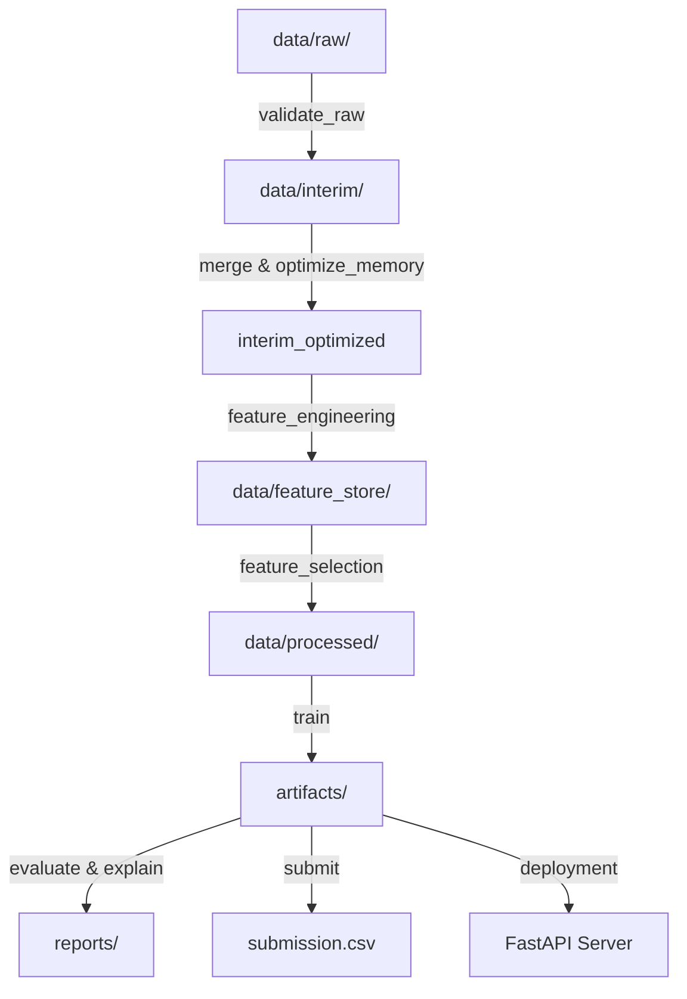

# Repository Architecture

This document describes the high-level architecture of the IEEE-CIS Fraud Detection system.

## System Components

1. **Hydra Configuration Engine (`configs/`)**:
   - Manages all parameters, paths, seeds, thresholds, hyper-parameters, and MLOps credentials.
   - Entry point: `configs/config.yaml`

2. **Data Pipeline (`src/data/`, `src/preprocessing/`)**:
   - Schema validation, merging identity and transaction databases, compressing types to conserve memory.

3. **Feature Store (`src/feature_engineering/`)**:
   - Calculates frequency encoding, aggregated statistics, device groupings, email and time-based metrics, saving them as reusable parquets under `data/feature_store/`.

4. **Experimentation Tracker (`src/utils/mlflow_helper.py`)**:
   - Unified logger for MLflow. Handles local offline fallbacks (logs locally under `mlruns/` if server is unreachable).

5. **DVC Pipeline Orchestrator (`dvc.yaml`)**:
   - Declares the dependency graph, inputs, parameters, and outputs. Run via `dvc repro`.

6. **Web API Serving Layer (`src/deployment/`)**:
   - FastAPI server executing real-time fraud probability scores.
