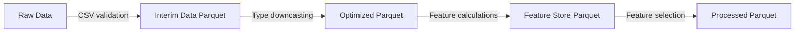

# Data Pipeline Architecture

This document explains the data stages, schemas, formats, and storage directories.

## Directory Setup and Formats

### 1. `data/raw/`
- Originally downloaded from Kaggle (IEEE-CIS Fraud Detection dataset).
- Format: `CSV`
- Files: `train_transaction.csv`, `train_identity.csv`, `test_transaction.csv`, `test_identity.csv`.

### 2. `data/interim/`
- Holds merged (`transaction4.5 Ratio Features` + `identity`) data sets.
- Downcasted to lightweight types to reduce RAM footprint (e.g. float64 -> float32, int64 -> int32).
- Format: `Parquet`

### 3. `data/feature_store/`
- Contains calculated feature groups designed for modeling:
  - `frequency_features.parquet` (frequencies of host/device/etc)
  - `aggregation_features.parquet` (mean, std dev of amounts aggregated by cards)
  - `identity_features.parquet` (engineered groups from identity files)
- Format: `Parquet`

### 4. `data/processed/`
- Training-ready tables (merged features that passed importance, null-rate, and correlation filters).
- Format: `Parquet`

### 5. `data/metadata/`
- Stores structural reports (data schemas, column maps, statistical logs, and drift reports).
- Format: `JSON`
