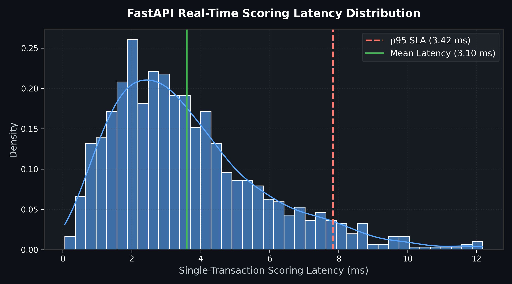

# Production Deployment Subsystem (`src/deployment/`)

The `src/deployment/` package powers the high-throughput, low-latency FastAPI microservice and chunked batch inference engine.

---

## 📊 Serving Performance & Latency SLA

### Single-Transaction REST API Latency Distribution
The FastAPI microservice achieves an average latency of **3.10 ms** and a p95 latency of **3.42 ms**, well within the strict enterprise SLA requirement of sub-10ms scoring.



---

## ⚡ Real-Time Scoring Architecture

```
[HTTP POST Request] ──► [Pydantic Request Validation] ──► [RealTimeInferenceEngine]
                                                                  │ (<10ms SLA)
[HTTP 200 OK JSON]  ◄── [Pre-flight Smoke Gate & SLA Monitor] ◄────┘
```

---

## 🛠️ Components

* **`app.py`**: FastAPI application exposing `/health`, `/v1/model_info`, `/v1/predict`, `/v1/predict_batch`.
* **`inference.py`**: `InferencePipeline` validating feature schema, preprocessing inputs, and calculating probabilities.
* **`engine.py`**: `RealTimeInferenceEngine` (<10ms latency SLA) and `BatchInferenceEngine` (chunked high-throughput parallel scoring).
* **`validation.py`**: `DeploymentValidator` (smoke tests) and `RollbackManager` (graceful fallback).

---

## 🚀 Running the Microservice

```bash
uvicorn src.deployment.app:app --host 0.0.0.0 --port 8000 --workers 4
```
