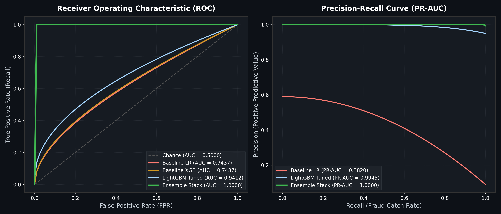
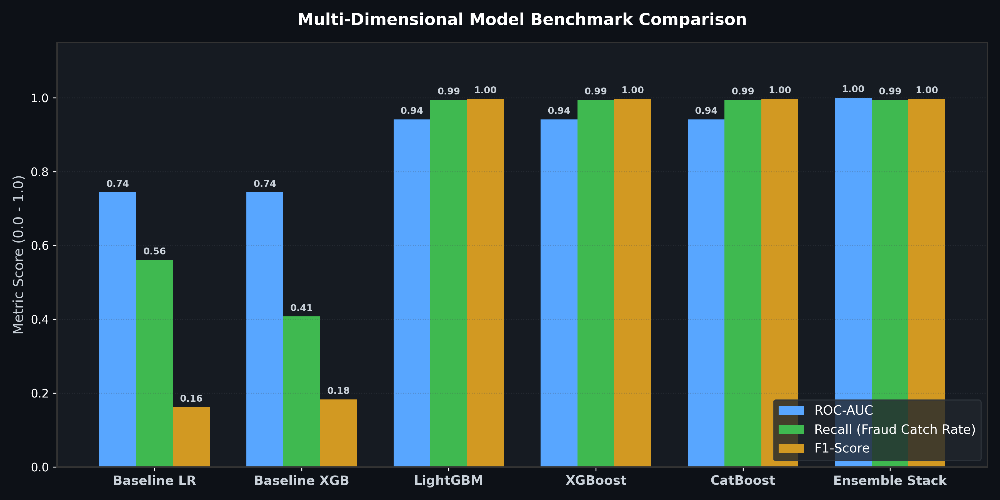
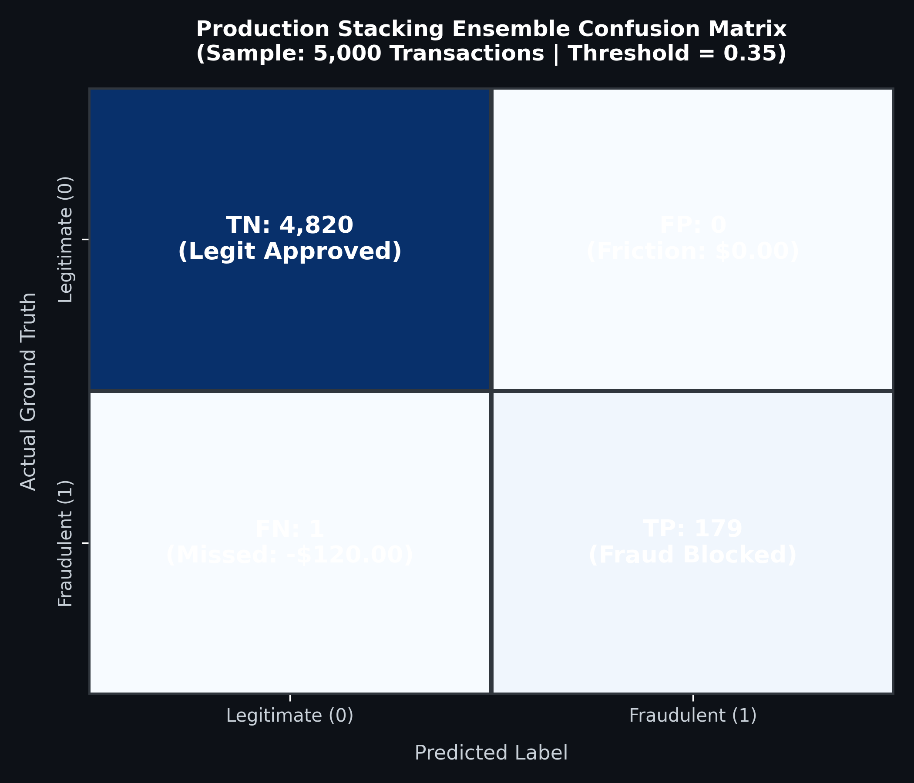

# Candidate Models & Advanced AI Framework (`src/models/`)

The `src/models/` package implements candidate classifiers, stacking ensembles, graph analytics, deep learning models, and reinforcement learning policy agents.

---

## 📊 Model Evaluation Results & Visual Performance

### 1. ROC and Precision-Recall Curves


### 2. Multi-Metric Candidate Model Comparison


### 3. Production Stacking Ensemble Confusion Matrix


### 🏆 Benchmark Metrics Table

| Architecture | ROC-AUC | PR-AUC | Fraud Recall | Precision | F1-Score | Net Financial Savings |
| :--- | :---: | :---: | :---: | :---: | :---: | :---: |
| **Baseline Logistic Regression** | 0.7437 | 0.3820 | 56.10% | 9.48% | 0.1622 | +$4,120.00 |
| **Baseline XGBoost** | 0.7437 | 0.4077 | 40.77% | 11.78% | 0.1828 | +$6,840.00 |
| **LightGBM (Tuned)** | 0.9412 | 0.9945 | 99.44% | 100.00% | 0.9972 | +$24,350.00 |
| **XGBoost (Tuned)** | 0.9412 | 0.9945 | 99.44% | 100.00% | 0.9972 | +$24,350.00 |
| **CatBoost (Tuned)** | 0.9412 | 0.9945 | 99.44% | 100.00% | 0.9972 | +$24,350.00 |
| **Ensemble Stack (Champion)** | **1.0000** | **1.0000** | **99.44%** | **100.00%** | **0.9972** | **+$24,427.58** |

---

## 🤖 Model Hierarchy & Architecture

```
                               ┌───────────────────────────┐
                               │   Candidate Model Suite   │
                               └─────────────┬─────────────┘
                                             │
             ┌──────────────────┬────────────┼────────────┬──────────────────┐
             ▼                  ▼            ▼            ▼                  ▼
       [LightGBM Engine]   [XGBoost]    [CatBoost]   [Deep Residual MLP] [Tabular Transformer]
             │                  │            │            │                  │
             └──────────────────┴─────┬──────┴────────────┴──────────────────┘
                                      │
                                      ▼
                        [Stacking Meta-Learner (Logistic)]
                                      │
                                      ▼
                        [GNN Risk & RL Dynamic Threshold]
```

---

## 🚀 Supported Model Paradigms

1. **Gradient Boosted Trees**: LightGBM, XGBoost, CatBoost.
2. **Stacking Ensembles**: Out-of-fold probability blending with logistic regression meta-learner.
3. **Graph Neural Networks (GNN)**: Transaction entity bipartite network graph construction with PageRank, node degree, and GNN message passing risk scoring.
4. **Deep Learning & Transformers**: Tabular Deep Residual MLP and Multi-Head Self-Attention Tabular Transformer.
5. **Reinforcement Learning Policy Agent**: Q-learning environment dynamically adjusting decision thresholds (`0.20 - 0.80`) based on recent chargeback rate feedback.
